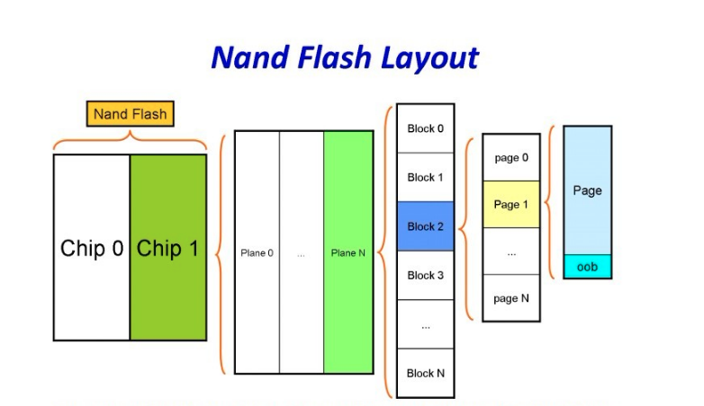
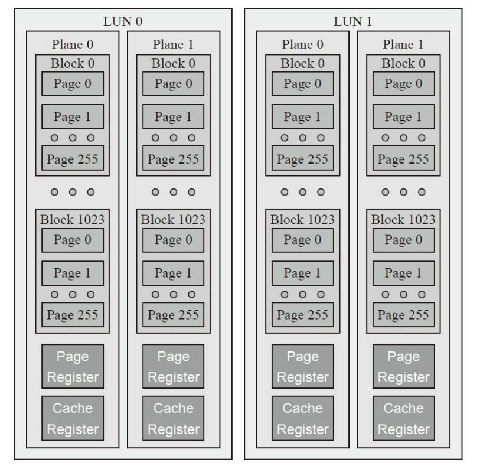
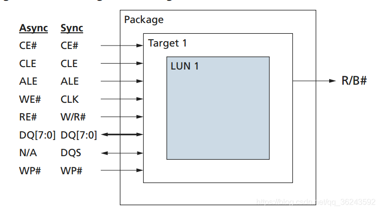
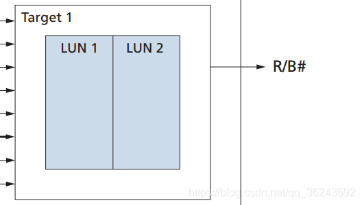
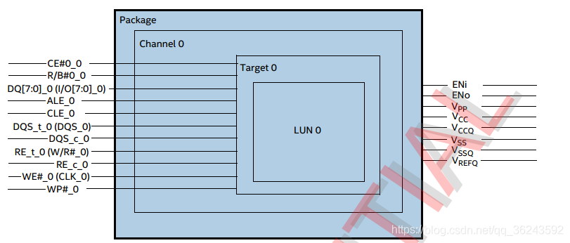
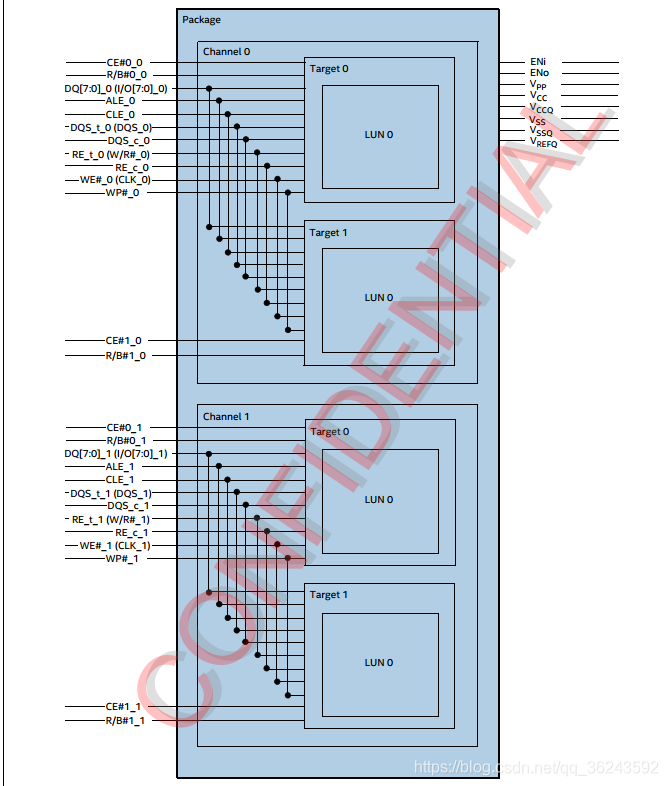
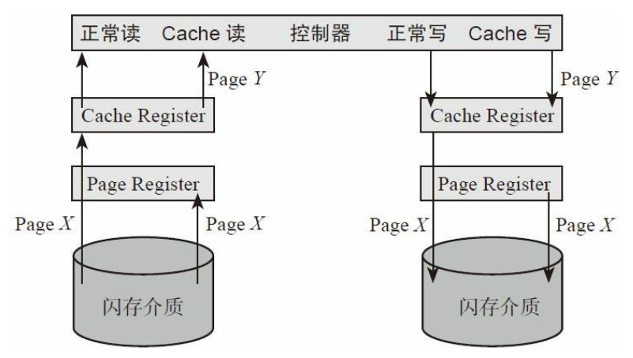
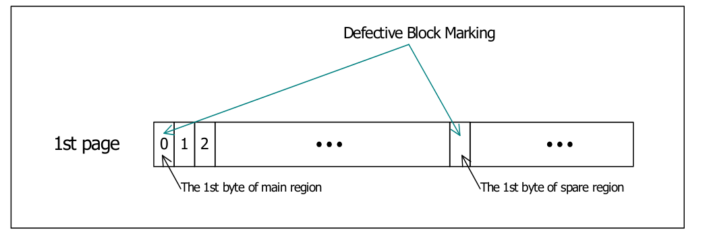
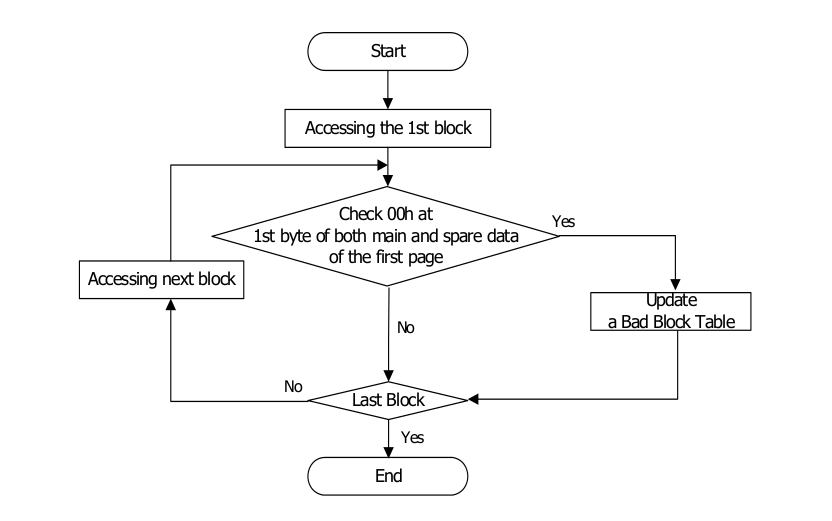

## 基本概念
        
NAND Flash是从原始的硅材料加工出来的，硅材料被加工成晶圆(Wafer)，一片晶圆上可以做出几百颗NAND FLASH芯片。芯片未封装前的晶粒成为Die，它是从Wafer上用激光切割而成的小片，每个Die就是一个独立的功能芯片，它由无数个晶体管电路组成，但最终可被作为一个单位封装起来成为闪存颗粒芯片。

NAND Flash的容量结构从大到小可以分为Device、Target、LUN、Plane、Block、Page、Cell。一个Device有若干个Die(或者叫LUN)，每个Die有若干个Plane，每个Plane有若干个Block，每个Block有若干个Page，每个Page对应着一个Wordline。

### 闪存内部基本结构

> 1. Device就是指单片NAND Flash，对外提供Package封装的芯片，通常包含1个或多个Target；
> 2. Target拥有独立片选的单元，可以单独寻址，通常包含1或多个LUN；
> 3. LUN: Logical Unit (最小可独立执行命令和上报状态的单元),通常包含多个plane;
> 4. Plane拥有独立的Page寄存器，通常LUN包含1K或2K个奇数Block或偶数Block；
> 5. Block是能够执行擦除操作的最小单元，通常由多个Page组成；
> 6. Page是能够执行编程和读操作的最小单元，通常大小为4KB/8KB/16KB/32KB等;
> 7. Cell是Page中的最小操作擦写读单元，对应一个浮栅晶体管，可以存储1bit或多bit数据，主要可颗粒类型。

### package

### target

### 什么是channel
channel 表示有几组ALE、CLE、IO[7:0]、DQS、RE、WE、WP信号线.

*只有一个channel*

*包含多个channel*

### cache page缓存

> 为什么需要Cache Register和Page Register两个缓存？主要目的是优化闪存的访问速度。闪存支持Cache读、写操作，如上图所示。Cach读支持在传输前一个Page数据给主控的时候（Cache Register→主控），可以从闪存介质读取下一个主控需要读的Page的数据到PageRegister（闪存介质→Page Register），这样数据在闪存总线传输的时间就可以隐藏在读闪存介质的时间里（或者相反，取决于哪个时间更长）；Cache Program也是如此，它支持闪存写前一个Page数据的同时（Page Register→闪存介质），传输下一个要写的数据到CacheRegister（主→Cache Register），这样数据在闪存总线传输可以隐藏在前一个Page的写时间里。

### 为什么闪存擦除最小单位为block
闪存的擦除是以Block为单位的。为什么呢？那是因为在组织结构上，一个Block当中的所有存储单元是共用一个衬底的（Substrate）。当你对某衬底施加强电压，那么上面所有浮栅极的电子都会被吸出来。

### 什么是OOB(out-of-band)
又叫空闲区域（spare area）/冗余区域（redundant area）
> 旧的小页, 512,每一页包含额外16个字节内容,不计入页大小.前三个字节存放ECC, 第六个字节标识是否坏块, 不是坏块之位0xff.
### 什么是ECC(Error Checking and Correction)
ECC的全称是Error Checking and Correction，是一种用于 Nand 的差错检测和修正算法。如果操作时序和电路稳定性不存在问题的话， NAND Flash 出错的时候一般不会造成整个 Block 或是 Page 不能读取或是全部出错，而是整个 Page （例如 512Bytes ）中只有一个或几个 bit 出错。 ECC 能纠正1 个比特错误和检测2 个比特错误，而且计算速度很快，但对 1 比特以上的错误无法纠正，对 2 比特以上的错误不保证能检测。

### 坏块处理
1. 替换表
此方法是将NAND存储空间中预留出一些块作为保留块，当遇到坏块时，在预留的保留块中选一个块来替换坏块，将原来写到坏块的数据写到替换块中；
2. BBT（Bad block table）
此方法核心是跳过坏块，但是跳过后需要在NAND闪存指定位置写入一个坏块表（Bad block table）

### flash出厂检测(skhynix海力士3D-V5)
检查每个block的main area第一个字节和spare area第一个字节是否为00h, 00h为坏块标识.

*检测流程*
