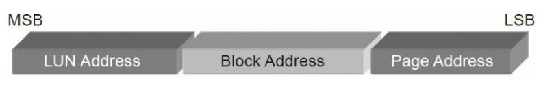

## nand flash操作基本命令
### 寻址
*概念*  
LSB(Least significant bit最低有效位)和MSB（Mostsignificant bit最高有效位）。
MSB是指一个n位二进制数字中的n-1位，具有最高的权值2^(n-1)，在大端序中，MSB即指最左端的位，LSB则相反。
#### 行寻址

*Multi-Plane寻址*

#### 列寻址
列地址为页内偏移
### 基本命令

### 读时序

> 在用户发送命令00～30h之间传输了所读的
地址，包括2个列地址和3个行地址。发完命令后，SR[6]（Status
Register，状态寄存器，bit 6）状态转为Busy，经过一段时间之后SR[6]
状态转为Ready，数据就可以读了。
### 写时序

> 用户发了80h命令之后，发送写地址，一般
列地址是0，因为要把一个Page写满，如果不从头开始写满一个Page，
往往会导致数据出错。发完地址tADL时间之后，开始传输数据到闪存
的缓存。数据传完，发送命令10h，闪存芯片开始向介质写入数据，
SR[6]状态为Busy，在写操作完成后状态转为Ready。
### 擦除时序

> 擦除比较简单，在命令60h和D0h之间发送LUN和
Block行地址即可（因为擦除是以Block为单位）。
### 编程和擦写原理

数据在Flash内存单元中是以电荷(electrical charge) 形式存储的。存储电荷的多少，取决于图中的外部门（external gate）所被施加的电压，其控制了是向存储单元中冲入电荷还是使其释放电荷。而数据的表示，以所存储的电荷的电压是否超过一个特定的阈值Vth来表示，因此，Flash的存储单元的默认值，不是0（其他常见的存储设备，比如硬盘灯，默认值为0），而是1，而如果将电荷释放掉，电压降低到一定程度，表述数字0。
擦除时,word line施加高电压, 电子会离开floating gate向下运动, 所有连接这个word line的page都会被清掉, 每个连接一个word line的page构成一个block,所以擦除是以block为单位.
编程时,是从word line的起始位置开始,所以, 页面要连续.
bit line只能对一个bit充电, 即 1->0, 不能针对一个bit放电, 所以编程时要先擦除, 及对block放电.

### ONFI与Toggle协议
nand flash接口协议