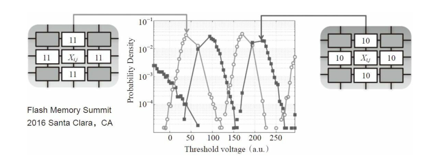

### 基本功能简介
FTL是Flash Translation Layer的缩写，是SSD的一个重要组成部分，实现了以下功能：

1. Interface Adapter： 在内部FTL中主要关联eMMC/SCSI/SATA/PCIe/NVMe等接口，而在外部FTL中主要关联Linux Block Device。
2. Address Translation： 地址映射，也可以叫做mapping，负责逻辑地址和物理地址之间的映射，多技术模块都以该机制为核心进行。众所周知，Nand Flash具有写时擦除的特性，因此写入数据时不得不异地更新。
3. Garbage Collection： 垃圾回收，简称GC，回收异地更新产生的脏数据所占空间的回收工作。
4. Wear Leveling： 磨损均衡，简称WL，避免某一个Nand Block很快坏去，使所有Block的PE Cycle均衡发展。因为flash的擦写次数是有限制的，如果不进行磨损均衡，整个SSD的有些block可能擦写次数不平衡很快坏去。
5. Power off Recovery： 掉电恢复，简称POR。正常掉电，SSD会把缓存中的数据刷新到闪存，重新加载保存的数据即可。如果是异常掉电，因为某些人为或自然外力的原因导致数据没有成功写入到Nand中，掉电恢复要恢复到掉电前的安全状态，比如恢复RAM中的数据和Address Translation中的映射表。
6. Parallelization and Load Balancing： 在前面的2.4小节的闪存的内部组织架构介绍中，可以知道SSD中存在的一定的并发性，利用这些并发性可以提供SSD的并发请求处理能力，提高其性能。
7. Cache Manager： Cache不仅可以存放用户数据，也可以存放FTL Metadata，对系统的整体性能有着天然的优势。
8. Error Handler： 处理读写操作中遇到的Fatal Error或ECC Error状况，以及Bad Block或Weak Block的管理。
   
### 闪存错误来源
1. 擦写次数过多,导致氧化层老化,电子易泄漏,读取数据异常.
2. cell中储存的电子自然流失,导致数据错误.
3. 读一个Wordline数据时，需要施加V pass 电压在其他Wordline上，导
致其他闪存页发生轻微写。如果读的次数过多，轻微写累积起来就会使
阈值电压分布发生右移，导致读数据时候发生误判，即读数据错误.
4. 存储单元相互干扰, 由于存储电子的浮栅极是导体，两个导体之间构成电容，一个存储单元电荷的变化会导致其他存储单元电荷变化，而受影响最大的就是与它相邻的存储单元。周围的单元是不同的状态时，中心单元的阈值电压是不一样的.
   
5. 写错误, 一般发生在MLC或者TLC 2-pass（先写Lower Page，然后再
写Upper Page）写过程中。写Upper Page的时候，它是基于之前Lower
Page的状态，然后再写每个存储单元到目标状态。如果写Upper Page的
时候，Lower Page数据已经出错（注意写Upper的时候，Lower Page的数
据是不会经过控制器ECC纠错的，写过程发生在闪存内部），就会导致
存储单元写到一个不期望的状态，即发生写错误。  
数据一开始就写错了，当然就别指望读对了。  
TLC 1-pass program则没有这个问题，因为Lower Page和Upper Page
是一次性同时写入，写Upper Page不依赖于Lower Page数据。当然，如
果一开始擦除状态就不对，那么还是会发生写错误。