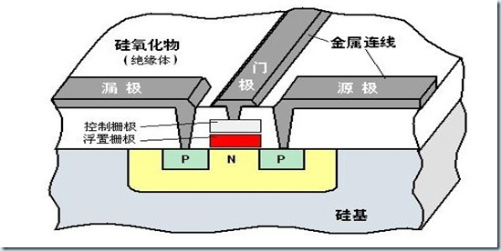
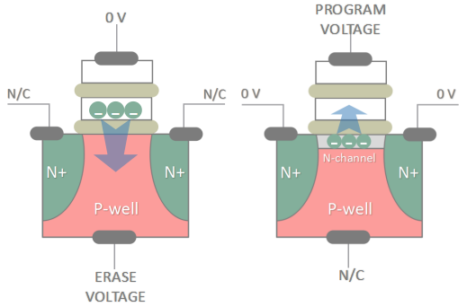
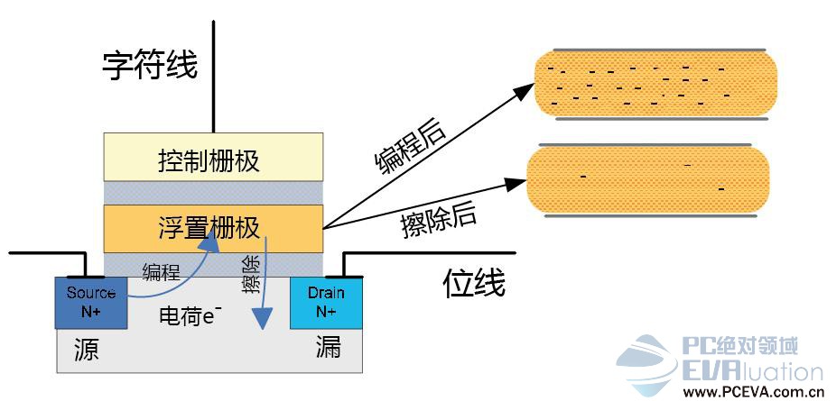
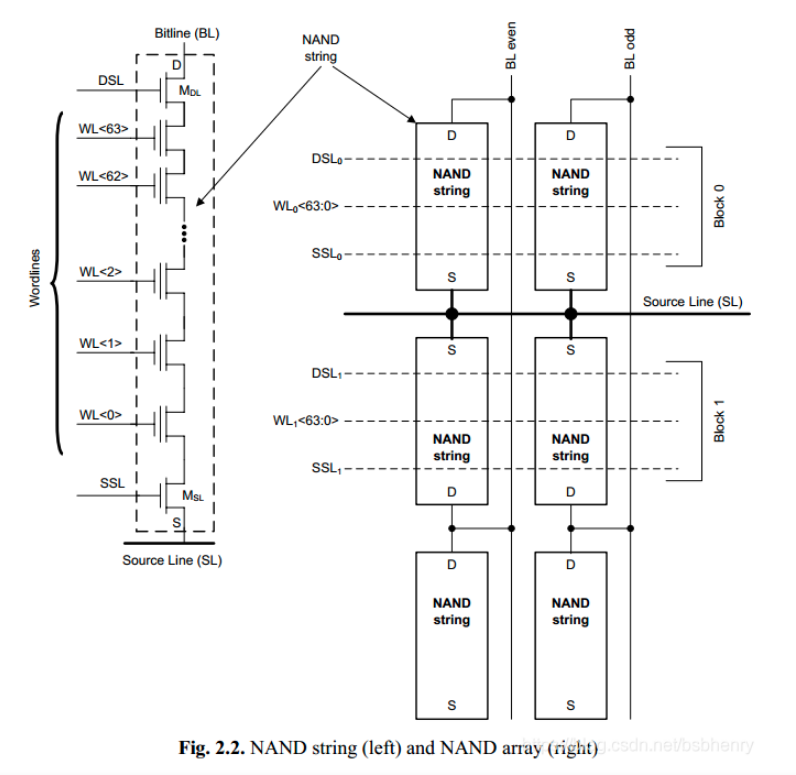
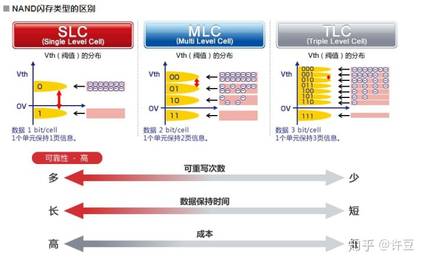

 ## 闪存内部原理

&nbsp;由其存储的颗粒结构，知道闪存式一种电压元件，其靠电压来存储数据，那么来看看其结构以及工作原理。闪存的内部存储结构是金属-氧化层-半导体-场效应管(MOSFET)：源极，漏极和栅极，其工作原理与场效应管类似，都是电压利用控制源极和漏极之间的通断，不同的是场效应管是单栅极结构，而闪存是双栅极结构，在栅极和硅衬底之间还有一个浮置栅极，浮置栅极是有氮化物夹在二氧化硅材料之间构成。

> 1. 对于闪存的写入，即控制栅极去充电，对栅极加压，使得浮置栅极存储的电荷越多，超过阈值，就表示0
> 2. 对于闪存的擦除，即对浮置栅极进行放电，低于阈值，就表示1
> 3. 读取数据时，我们同样会在控制闸施加电压，好吸住浮置闸里的电子，但不用到穿隧注入（Tunnel Injection）电子时那么高，同时让 N通道流过电流，利用电流来感应浮置闸里电子捕获量的多寡，靠感应强度转换为二进制的 0与1，最后输出成数据。

## Word Line

在String中，cell是串行方式连接的，一般32或64个一组，两端分别通过MSL连接到source line，MDL连接到bit line，并分别由晶体管控制开断。每个string和相邻的string（图中是上下方向）共用bit line。control gate是通过wordlines连接在一起。
Page是一个逻辑上的概念，page是由同一根wordline上的cell组成的。一根wordline上的page个数是由cell存储bit的能力决定的。SLC memory 单个cell可以存储1bit信息，MLC则可以存储2bit，TLC是3bit，QLC则是4bit。按照图中示意，bitline 分为even/odd两组，相应的cell也分为了两组，这两组分别属于两个page。
根据以上定义，则一个SLC的设备，一根wordline可以分为两个page，假设总共有65536个cell，则每个page的大小为4KB。
而MLC单个cell可以存储2bit的信息，则从逻辑上又可以进一步细分为两个page，一个是lower page，即由LSB（least significant bit）组成，一个是upper page,由MSL（most significant）组成。这样一个MLC的设备，一根wordline就分为了四个page。类似的，TLC单个cell可以存储3bit的信息，则有lower/middle/upper page。
对于擦除操作，同一组wordline上的所有string是一起进行的，它们组成了一个block。如上图，有两组wordline，WL0[63:0]和WL1[63:0]，对应的分别是block0，block1。

## 闪存寿命衰减原因
为什么没有机械结构的SSD还是出现寿命问题？因为按照工作原理，闪存单元每次写入或擦除的施加电压过程都会导致绝缘体硅氧化物的物理损耗。这东西本来就只有区区10纳米的厚度，每进行一次电子穿越就会变薄一些。

也正因为如此，硅氧化物越来越薄，电子可能会滞留在二氧化硅绝缘层，擦写时间也会因此延长，因为在达到何时的电压之前需要更长时间、更高的加压。主控制器是无法改变编程和擦写电压的。如果原本设计的电压值工作异常，主控就会尝试不同的电压，这自然需要时间，也会给硅氧化物带来更多压力，加速了损耗。

最后，主控控制编程和擦写一个TLC闪存单元所需要的时间也越来越长，最终达到严重影响性能、无法接受的地步，闪存区块也就废了。
## 闪存分类
**SLC MLC TLC介绍**

SLC Single-Level Cell，意味着每个存储单元只存放 1bit讯息，靠浮置闸里电子捕获状态的有或无来输出成数据（即使在 0的状态浮置闸里其实还是有电子，但不多），也就是最简单的 0与1；

MLC Multi-Level Cell，意味着每个存储单元可存放 2bit讯息，浮置闸里电子的量会分为高、中、低与无四种状态，转换为二进制后变成 00、01、10、11；

TLC Triple-Level Cell ，更进一步将浮置闸里的电子捕获状态分成八种，换算成二进制的 000、001、010、011、100、101、110、111，也就是3bit。

**性能 寿命 成本**
