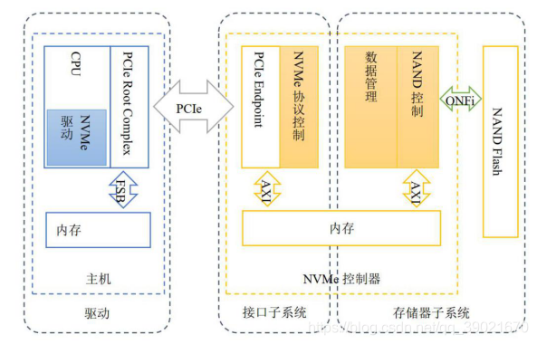
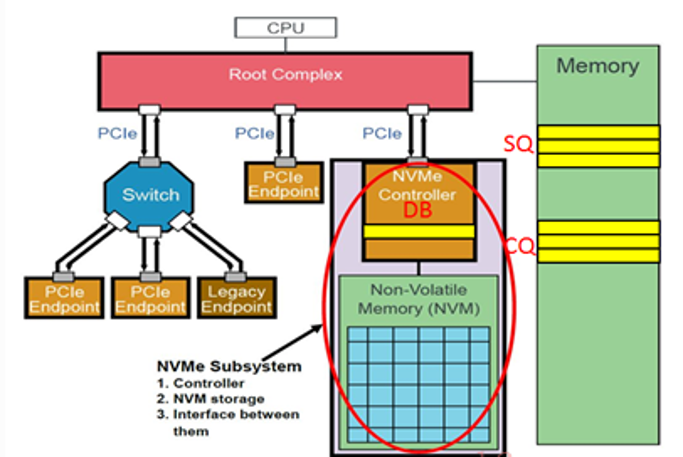
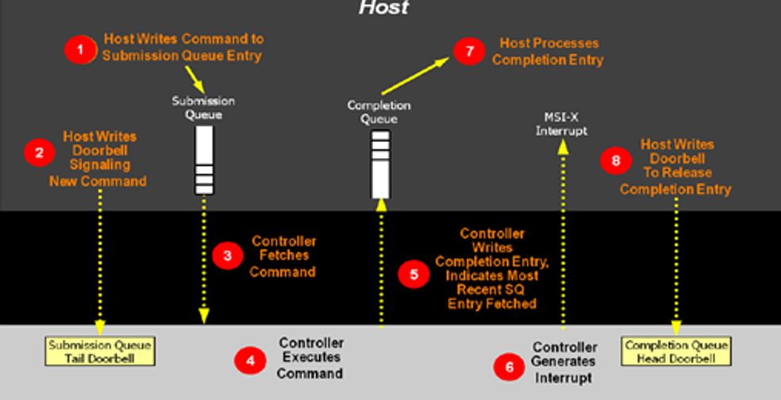

## nvme设备基本结构

## nvme命令执行过程
SQ位于Host内存中，Host要发送命令时，先把准备好的命令放在SQ中，然后通知SSD来取；CQ也是位于Host内存中，一个命令执行完成，成功或失败，SSD总会往CQ中写入命令完成状态。DB则是在Host发送命令时，不是直接往SSD中发送命令的，而是把命令准备好放在自己的内存中，Host就是通过写SSD端的DB寄存器来告知SSD命令已经处理完毕，可以前来检阅。

